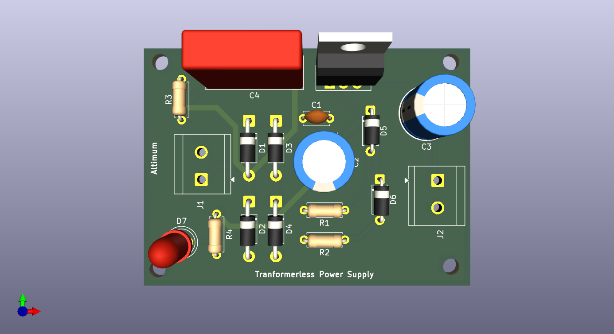
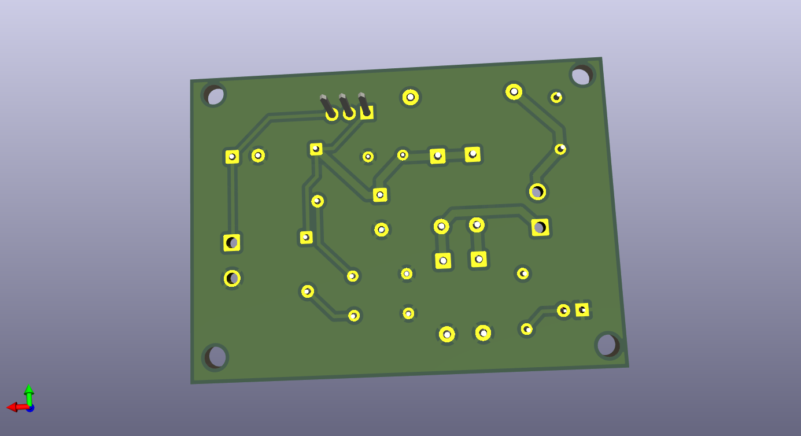

# TRANSFORMER LESS POWER SUPPLY PCB Design using KICAD -ALTIMUM
## PCB TOP VIEW

## PCB BOTTOM VIEW

## Project Overview
This transformer-less power supply converts 220–240V AC mains into regulated 5V DC without using a step-down transformer by first passing the AC input through a 2.2µF capacitor that limits current through capacitive reactance, effectively reducing the usable voltage; the limited AC is then converted into pulsating DC using a bridge rectifier made of four 1N4007 diodes, after which filter capacitors smooth the ripple to produce a more stable DC level, and finally an L7805 voltage regulator provides a constant 5V DC output, with an LED indicator showing power status—however, since the circuit is directly connected to mains supply and has no isolation, it must be handled with extreme caution. This project is my attempt at learning KiCad and understanding the design and working of transformer-less power supply circuits.
